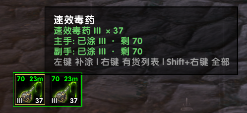
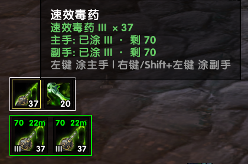
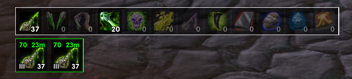

# MartletPoison

Turtle WoW（1.18.1）盗贼涂毒助手。全新独立插件，**不改动 EzPoison 任何文件**。

## 截图

收起态看板 + 悬停 tooltip（看板边框随两手余量较差侧显色，此处两手充足 = 绿）：



有货列表（悬停显示各等级数量与两手状态）：



全量列表（毒药 + 磨刀石，无货的降透明度；列表边框恒白）：



## 核心原则

面板显示的是**武器状态**而不是背包库存；点击 = 涂抹；没有任何影响行为的隐藏状态。
（唯一记忆：每只手最后一次涂的种类，用于看板显示与补涂，不改变列表点击的含义。）

## 主面板 = 看板（v0.2.0）

收起态仅约 100px 宽：一个 group 框住两个 40px 图标位——左=主手看板，右=副手看板，
各自显示该手当前（或最后一次）涂的毒：

```
┌─ group ──────────────┐
│  次数  时间           │   次数: 剩余次数, 时间型显示 ∞
│    [毒药图标]         │   时间: 剩余时间
│  等级  库存           │   等级: 涂的等级 (如 VI), 空手显示 -
│                      │   库存: 该毒背包总数
└──────────────────────┘
```

- 次数/时间两角各按余量走 绿→黄→橙→红 色阶（>50% 绿 / >25% 黄 / 10~25% 橙 / <10% 红）
- 空手（有记忆）：图标半透明，次数角红 0（时间型 ∞ 不变），时间角红 0，等级角 -
- 两只手涂同一种毒：两个看板各自独立显示

## 鼠标操作

| 手势 | 看板上 | 展开的列表项上 |
|---|---|---|
| 左键 | 补涂该手上次的毒 | 涂主手 |
| 右键 | 开/收 **有货列表** | 涂副手 |
| Shift+右键 | 开/收 **全量列表**（毒药+磨刀石） | 涂副手 |

- 列表收起：看板右键再点一次（列表开着时右键看板即收起）
- 看板左键带防浪费护栏：该手同种毒还在且余量充足（绿/黄）时无效，橙/红才真的补
- 列表两种模式二态切换；看板与列表各带**独立边框**：看板边框颜色跟随两手余量较差一侧的色阶（完全无记忆=白），列表边框恒白不做警示；列表项只显示库存，不显示余量（看板管这个）
- **列表在看板组上方弹出**（适配看板贴屏幕底部摆放，展开时看板保持原位不动）
- 等级选择：永远用背包里最高等级的一瓶；想涂低级的自己开背包

## 悬停 Tooltip

种类名 ｜ 背包内各等级数量 ｜ 两手当前状态（含等级） ｜ 灰字操作提示

## 技术要点

- 涂抹连招移植自 EzPoison（使用毒药 → 点武器槽 → 确认替换），原子操作
- **双语**：背包匹配按物品 ID（语言无关）；武器附魔按中英文名+特征匹配；界面文案按客户端语言自动切换。乌龟服自定义物品英文名（Incite / Dissolvent / Holy 系）如与实际不符，改 `MartletPoison.lua` 数据表即可
- 数据表：物品 ID + 各等级名称（静态）；满次数/满时长在涂抹时自动标定并随角色存档
- 等级从武器 tooltip 行内解析（高等级后缀优先匹配，天然避开 II/III 子串陷阱）
- 时间类角标 1s OnUpdate 主动刷新；附魔脱落（超时无事件）由秒级心跳比对检出
- pfUI 皮肤适配
- 保留：位置拖动/锁定、缩放、时间红字阈值（/mpoison time N）

## 明确不做

- 方案（配置文件）概念
- 等级选择（永远最高级）
- Auto-Apply 智能补涂键
- 中键（闲置，留给未来）
- 手动隐藏图标（被 有货/全量 两种列表取代）

## 与 EzPoison 的关系

独立共存、互不影响；本插件定稿后停用 EzPoison。
制毒购买助手（buyer）暂仍由 EzPoison 提供，面板定稿后整体迁入。

## 版本

- v0.3.1：大红阈值提前到 <10%；边框拆分——看板边框颜色跟随两手余量较差一侧，列表边框恒白
- v0.3.0：双语化（中英客户端通用，背包按物品 ID 匹配）；列表改为看板上方弹出
- v0.2.1：列表项右键恢复涂副手（肌肉记忆优先于手势纯度），收起改由看板右键承担
- v0.2.0 看板版：双看板+四角信息+有货/全量列表，取代 12 图标墙与抽屉
- v0.1.0 图标墙版：12 图标横排 + 左主手/右副手/中键抽屉
